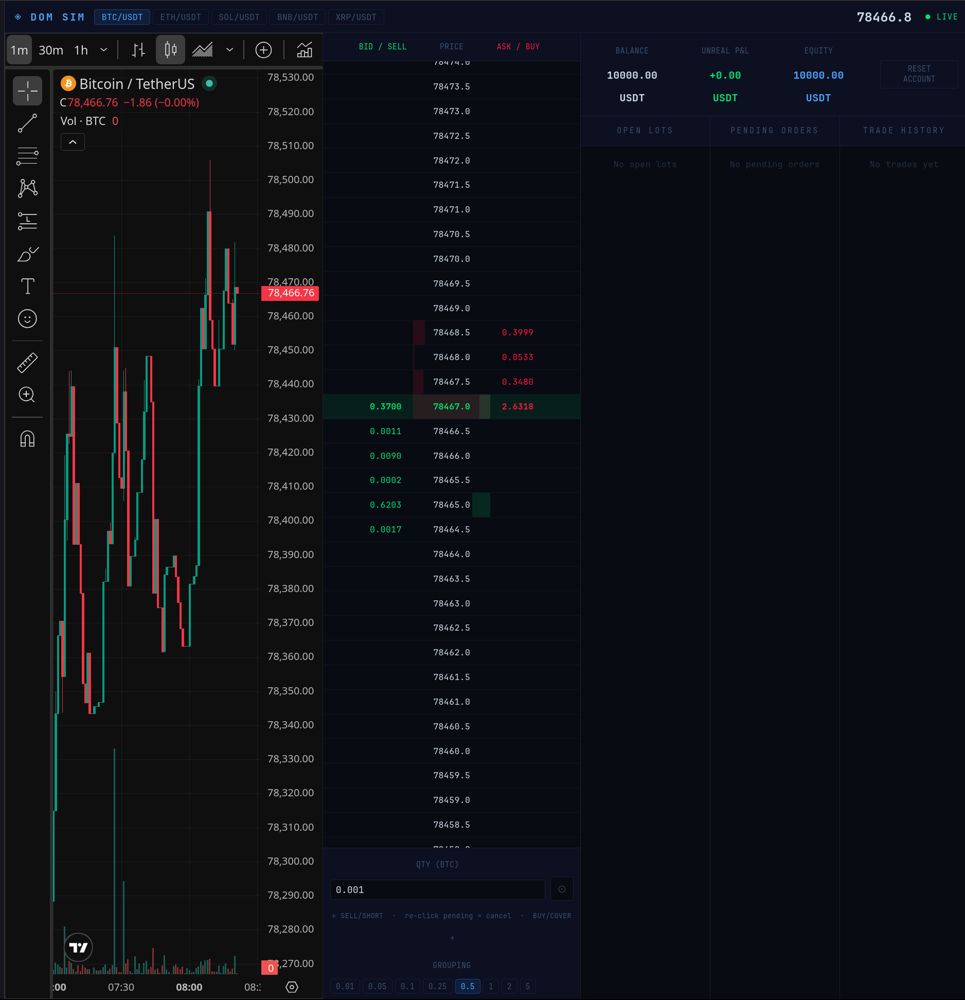

# DOM Sim

A browser-based Depth of Market (DOM) simulator for crypto trading practice. Streams live order book data from Binance and lets you place simulated limit and market orders with a virtual account.



**Demo website**: https://domsim.nextmiracle.eu/

## Features

- **Live order book** — real-time bid/ask depth via Binance WebSocket (`depth20@100ms`)
- **Configurable tick grouping** — bucket order book levels by customizable tick sizes per instrument
- **Simulated trading** — buy, sell, short, cover with FIFO lot tracking
- **Limit orders** — click any DOM row to place a limit; orders fill automatically when price crosses
- **Market orders** — clicking at or through the current best bid/ask fills immediately
- **Multi-symbol positions** — open positions on multiple instruments simultaneously; P&L tracked per symbol
- **TradingView chart** — embedded 1-minute chart synced to the selected symbol
- **Virtual account** — $10,000 starting balance, with unrealized P&L and equity displayed in real time

## Supported Instruments

| Symbol   | Exchange       |
|----------|---------------|
| BTC/USDT | Binance Spot  |
| ETH/USDT | Binance Spot  |
| SOL/USDT | Binance Spot  |
| BNB/USDT | Binance Spot  |
| XRP/USDT | Binance Spot  |

## Getting Started

### Prerequisites

- Node.js ≥ 18
- A React project scaffold (Vite recommended)

### Install & Run

```bash
# Create a Vite + React project if you don't have one
npm create vite@latest dom-sim -- --template react
cd dom-sim

# Replace src/App.jsx with the provided file, then:
npm install
npm run dev
```

The app runs entirely in the browser. No backend required.

## Usage

### Placing Orders

The DOM ladder shows bids on the left column and asks on the right.

- **Click the left column (BID/SELL)** at a price level to place a sell or short order
- **Click the right column (ASK/BUY)** at a price level to place a buy or cover order
- **Re-click a highlighted row** (yellow) to cancel a pending order at that level
- Orders placed **at or through** the current best bid/ask execute immediately as market orders
- Orders placed **away from** the spread are posted as limit orders and fill when price reaches them

### Side Resolution

The order side is determined automatically based on your current position:

| Click direction | Has open longs? | Has open shorts? | Side placed |
|-----------------|-----------------|-----------------|-------------|
| Sell/Left       | Yes             | —               | SELL (close long) |
| Sell/Left       | No              | —               | SHORT (open short) |
| Buy/Right       | —               | Yes             | COVER (close short) |
| Buy/Right       | —               | No              | BUY (open long) |

### Account Model

This simulator uses a simplified cash-based P&L model:

| Action       | Balance effect            |
|--------------|--------------------------|
| BUY open     | `− fill × qty`           |
| SELL close   | `+ fill × qty`           |
| SHORT open   | `+ fill × qty` (proceeds credited) |
| COVER close  | `− fill × qty`           |

Unrealized P&L is calculated as:

- **Long**: `(currentPrice − entryPrice) × qty`
- **Short**: `(entryPrice − currentPrice) × qty`

**Equity** = Balance + Unrealized P&L across all open positions.

### Controls

| Control         | Description                                      |
|-----------------|--------------------------------------------------|
| Symbol tabs     | Switch between instruments                       |
| GROUPING        | Change the tick size used to bucket the DOM      |
| QTY input       | Set order quantity before clicking the DOM       |
| ⊙ button        | Re-center the DOM scroll on the current spread   |
| CLOSE button    | Market-close an individual lot at best bid/ask   |
| RESET ACCOUNT   | Wipe all positions, orders, and reset balance    |

## Architecture

Everything is a single React component (`DOMSim`) with no external state library.

- **WebSocket** — one connection per symbol, reconnects on symbol switch. Streams `depth20@100ms` and `miniTicker`.
- **Order book** — raw levels are bucketed into a fixed grid of `GRID_LEVELS * 2 + 1` rows centred on `lastPrice`.
- **Refs vs state** — mutable refs (`bookRef`, `pendingRef`, `balanceRef`, `lotsRef`) are used inside WebSocket callbacks to avoid stale closures; React state drives the render.
- **Limit fills** — checked synchronously on each depth update via `checkLimits`.

## Limitations & Caveats

- **No real money involved.** This is purely a paper trading simulator.
- **Binance WebSocket only.** Requires a browser environment where `wss://stream.binance.com` is accessible.
- **Short model is simplified.** No margin requirements or liquidation mechanics.
- **Positions on non-active symbols** are tracked but their prices only update while that symbol's WebSocket is connected.
- **No persistence.** Refreshing the page resets the account.
